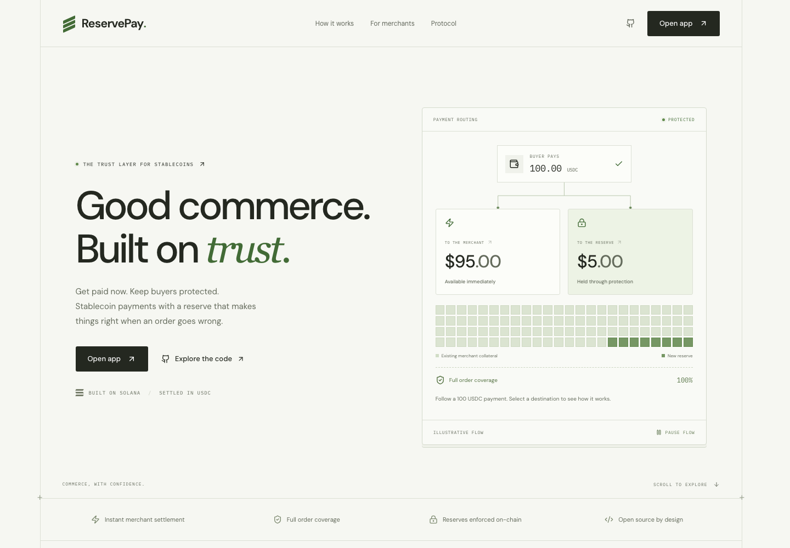
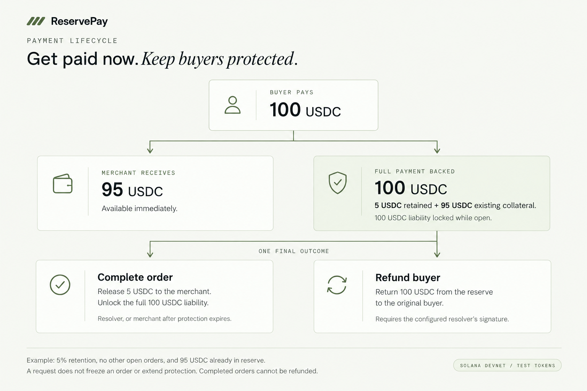
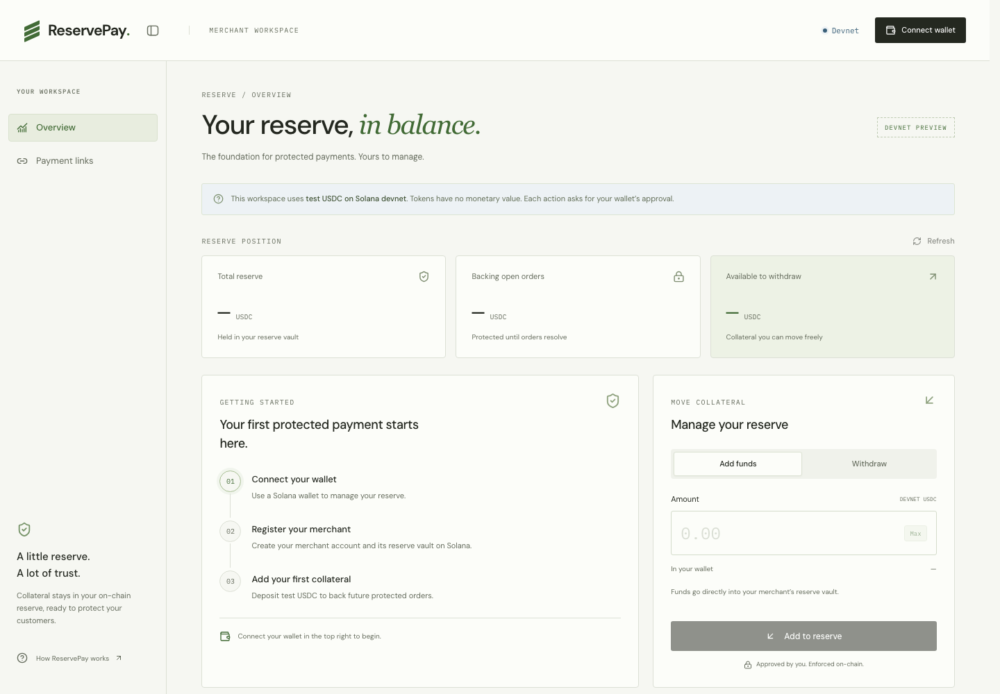
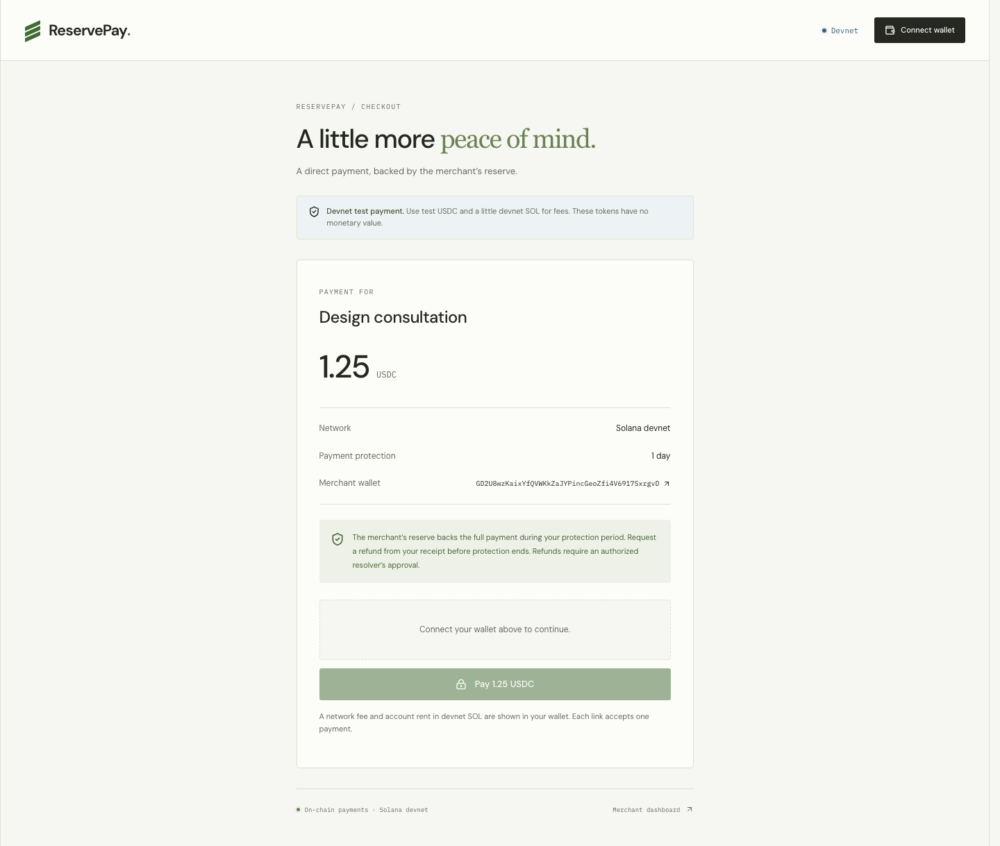
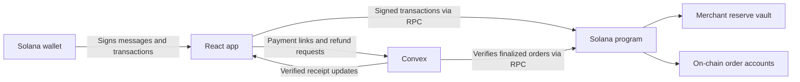

# ReservePay

**Get paid now. Keep buyers protected.**

ReservePay is a USDC payment app on Solana. Merchants receive most of each payment immediately, while a funded reserve backs full refunds for open orders. Buyers pay through a shareable link and keep an on-chain receipt.

[Open the app](https://reservepayyy.vercel.app/app) · [Explore the product](https://reservepayyy.vercel.app/) · [Payment links](https://reservepayyy.vercel.app/app/payments) · [Build checks](https://github.com/hemantwasthere/reservepay/actions/workflows/ci.yml)

> **Devnet preview.** The current app uses test USDC and devnet SOL, which have no monetary value. It is not a mainnet payment service.



## How it works

1. **Fund a reserve.** The merchant registers an on-chain account and deposits collateral into its reserve vault.
2. **Share a payment link.** The merchant approves a title, amount, and protection period with a wallet signature. Each link accepts one payment.
3. **Get paid immediately.** At checkout, the program sends the merchant’s share to their wallet and adds the retained portion to their reserve. It locks liability for the **full payment**, backed by the reserve’s existing collateral plus the new retention.
4. **Resolve the order.** Completion releases the retained portion and unlocks the liability. An authorized resolver can instead return the full payment to the original buyer from the reserve.



The diagram uses a 5% reserve rate and assumes no other open orders. The retained 5 USDC alone does **not** cover a 100 USDC refund: the merchant needs at least 95 USDC of existing collateral. Reserve rates come from the merchant’s on-chain configuration.

For a new payment to succeed:

```text
reserve balance + new retained amount ≥ existing locked liability + payment amount
```

Merchants can withdraw only the surplus above locked liability. Reserve checks, transfers, and order status changes are enforced by the Solana program.

## What you can do today

| Merchant                                            | Buyer                                                    | Resolver                                           |
| --------------------------------------------------- | -------------------------------------------------------- | -------------------------------------------------- |
| Sign in with a Solana wallet and register a reserve | Pay a single-use link with devnet USDC                   | Review pending refund requests                     |
| Deposit collateral and withdraw available funds     | View a receipt verified against finalized chain state    | Approve a full refund to the original buyer        |
| Create links and follow payment history             | Submit a signed refund request before protection expires | Complete an open order, including before expiry    |
| Complete orders after protection expires            | Follow the order’s final status from the same URL        | Approve every resolution with a wallet transaction |

The app also includes a collapsible sidebar (⌘B), mobile navigation, System/Light/Dark appearance, wallet switching, and recovery for pending transactions after a reload or uncertain network response. Components use Tailwind CSS and locally customized shadcn primitives. The appearance menu is in the header on the landing page, workspace and checkout. Press **Alt + Shift + T** (⌥⇧T on Mac) to cycle System → Light → Dark. Your choice persists across reloads and tabs; System follows changes to your device’s color scheme.

### Merchant workspace

The overview separates total reserve, funds backing open orders, and funds available to withdraw, with an on-chain order list filtered by open, completed, or refunded status. Payment links live on their own page. Sign a wallet message to access your link history and merchant profile; this login does not transfer funds.

At `/app/profile`, save a merchant name, image and website for buyers to see at checkout. Upload a PNG, JPG or WebP image (up to 2 MB); the app optimizes it before storing it in Convex. Images also appear on payment receipts. Contact email and description stay private to your signed-in wallet. Sessions last up to seven days; disconnecting signs out and cancels any pending login. Navigation between the landing page and workspace keeps the wallet, session and Convex subscriptions mounted, so switching sections or returning home preserves loaded data and unsaved profile edits. A full browser reload reconnects and validates the session; refreshing is not required to receive updates. Profile and payment-link updates arrive through Convex subscriptions. Solana balances and order accounts share a background RPC refresh; the backend also reconciles finalized payment receipts every two minutes.



_Live devnet UI, shown before connecting a wallet._

### Inbox and reminders

Open the bell in the workspace header and sign in with your wallet. Merchants and buyers receive refund-request acknowledgements and finalized refund/completion updates for their orders. The current on-chain resolver receives pending-dispute notifications on the background sweep. No merchant registration is needed to read a buyer's inbox.

Protection reminders are generated once within the final hour and once after the deadline if the cached order remains open. The worker checks every two minutes and resumes through large queues; backlog or network delays can make reminders late. A refund request does not extend protection. Always use the receipt for current status and deadlines.

Unread counts update live (capped at **99+**); opening the inbox does not mark anything read. Mark an individual update or the displayed batch as read, and load older updates as needed. Inbox contents and read state belong to the signed-in wallet and persist across devices. Historical updates can describe an order that has since resolved. Email and push delivery are not enabled.

### Buyer checkout

Each link shows the amount, merchant name (when configured), wallet, network, and protection period. After payment, the same URL becomes the receipt and the entry point for refund requests and order resolution.



_Sample devnet payment link. No wallet is connected in this screenshot._

## Protection has a deadline

A buyer’s signed request records their refund request; it does not transfer funds. **A request does not freeze the order, extend protection, or guarantee a refund.** The configured resolver must approve an on-chain refund while the order remains open.

After protection expires, completion is permissionless in the program; the app offers it to the merchant and resolver, and a configured, funded keeper completes expired undisputed orders automatically. The resolver can also complete early. Once an order is completed, it cannot be refunded through the program.

Payment metadata, receipts, and refund reason categories are public. Do not put private customer details in a payment title. The current workflow does not provide private evidence uploads, partial refunds, or email/push notifications. The workspace inbox provides wallet-scoped refund updates and protection reminders. Dispute decisions stay manual; only completion of undisputed expired orders is automatic.

See [refund and completion behavior](docs/order-resolution.md) for the complete workflow and recovery details.

## Architecture



- **Web app:** React, TypeScript, Vite, Tailwind CSS, and shadcn components.
- **Application backend:** Convex stores merchant profiles, hashed session tokens, approved link terms, verified receipts, and signed refund requests. It verifies signatures and chain state. The optional keeper holds a dedicated devnet fee key for permissionless completion; merchant, buyer, and resolver keys remain in their wallets.
- **Solana program:** Rust and Anchor enforce reserve coverage, payment splits, withdrawals, refunds, and completion.
- **Shared core:** Settlement calculations, program addresses, and PDA derivation.
- **Hosting:** Vercel serves the frontend. Convex functions and schema are deployed separately.

```text
apps/web/
  src/merchant/     Reserve workspace and wallet transactions
  src/payments/     Links, checkout, receipts, and resolution
  src/components/   Shared shadcn-based UI components
  convex/           Backend schema, queries, mutations, and actions
  tests/            Frontend logic and Convex tests
packages/core/      Shared settlement math and Solana addresses
programs/reservepay/ Anchor program
tests/             Local-validator integration tests
docs/              Workflow documentation and product images
```

## Run locally

You need [Bun](https://bun.sh/) **1.3.14 or newer**, a [Convex](https://www.convex.dev/) account/deployment, and a Solana wallet with devnet support for transaction flows. Frontend development does not require a local Solana validator.

```bash
git clone https://github.com/hemantwasthere/reservepay.git
cd reservepay
bun install --frozen-lockfile
bun run dev
```

The development command builds the shared package, starts Convex development, and launches Vite. On first run, follow Convex’s prompts to connect or create your own development deployment. Open the local URL printed by Vite.

Use devnet SOL for fees and account rent, and devnet USDC for payments and reserve deposits. A merchant must register and fund enough collateral before accepting a payment. Use a different wallet to pay that merchant’s link.

### Environment variables

The web app reads its local configuration from `apps/web/.env.local`:

```dotenv
CONVEX_DEPLOYMENT=dev:your-deployment
VITE_CONVEX_URL=https://your-deployment.convex.cloud
VITE_CONVEX_SITE_URL=https://your-deployment.convex.site
```

| Variable               | Used for                                                                             |
| ---------------------- | ------------------------------------------------------------------------------------ |
| `CONVEX_DEPLOYMENT`    | Convex CLI deployment selection; use the value generated for your project            |
| `VITE_CONVEX_URL`      | Frontend connection to the Convex backend                                            |
| `VITE_CONVEX_SITE_URL` | Convex HTTP endpoint; currently not consumed by app code                             |
| `VERCEL_OIDC_TOKEN`    | Optional Vercel CLI authentication in root `.env.local`; not required to run the app |

`VITE_` values are public browser configuration. Keep secrets out of them. Local environment files are gitignored. Without `VITE_CONVEX_URL`, the frontend can render, but payment-link data and backend workflows are unavailable.

Configure `SIGN_IN_SECRET` on the **Convex backend**, not in a `VITE_` variable. It must be a cryptographically random value of at least 32 characters. From `apps/web`, this generates a 32-byte secret and sends it to the selected development deployment without printing it:

```bash
openssl rand -hex 32 | bunx convex env set SIGN_IN_SECRET
```

Three more server-only backend variables control the order keeper and reconciliation; all are optional while you develop. Without `KEEPER_SECRET_KEY` the keeper skips every run and changes nothing, but payment reconciliation keeps running.

| Variable            | Used for                                                                                             |
| ------------------- | ---------------------------------------------------------------------------------------------------- |
| `KEEPER_SECRET_KEY` | Base58 secret of the dedicated keeper keypair; enables automatic release of expired orders           |
| `SOLANA_RPC_URL`    | Optional dedicated RPC for background reconciliation, order release, and post-release syncs; defaults to public devnet |
| `KEEPER_RPC_URL`    | Fallback alias for `SOLANA_RPC_URL`                                                                  |

See [devnet operations](docs/devnet.md) for keeper funding, reconciliation, and protocol setup.

For production, select the intended deployment with the Convex CLI's `--prod` option. Optional backend `SITE_ORIGIN` restricts sign-in to an exact origin such as `https://your-app.example.com` (no trailing slash). Without it, the hosted ReservePay domain and localhost are accepted. Keep an existing secret when redeploying; rotating it invalidates outstanding login challenges.

### Commands

Run these from the repository root:

| Command                | Purpose                                                       |
| ---------------------- | ------------------------------------------------------------- |
| `bun run dev`          | Shared-package build, Convex development, and Vite            |
| `bun run dev:web`      | Vite only; build the shared package first on a fresh checkout |
| `bun run dev:backend`  | Convex development only                                       |
| `bun run check`        | Type checking, tests, production build, SEO, and route checks |
| `bun run test`         | Core, frontend logic, and Convex tests                        |
| `bun run build`        | Production frontend build and prerendering                    |
| `cargo check`          | Rust workspace validation                                     |
| `bun run test:program` | Anchor integration tests on a local validator                 |
| `bun run idl:sync`     | Copy the built IDL and TS types into `apps/web/src/merchant/` |
| `bun run idl:check`    | Fail if the committed IDL differs from `target/`              |

The Anchor integration suite additionally requires Rust, the Solana CLI/local validator, and the Anchor CLI. The toolchain used by CI and new builds is pinned in [Anchor.toml](Anchor.toml) `[toolchain]`: **anchor-cli 1.0.2** with **Agave (solana-cli) 3.1.7**. The suite creates a local test mint and tests reserve accounting using disposable test tokens. `bun run test:program` builds the shared package and the program with `--ignore-keys`, then selects Agave's `solana-test-validator` with `--validator legacy`; bare `anchor test` defaults to surfpool in anchor-cli 1.0.x.

On a fresh clone, `anchor build` fails with *"Program ID mismatch"*: the deployer's program keypair is not in the repo, so anchor generates a random one that doesn't match `declare_id!`. Build with **`anchor build --ignore-keys`** — the local validator loads the program at the `Anchor.toml` address regardless. Never run `anchor keys sync`: it would rewrite the program ID in `declare_id!` and `Anchor.toml`, pointing the app at a program that doesn't exist.

After changing the program, run `anchor build --ignore-keys && bun run idl:sync` and commit the updated `apps/web/src/merchant/reservepay.{json,ts}` together with the program change — the backend decodes accounts and errors from these files. CI fails the `program` job with a diff when the committed IDL drifts from the build output.

## Devnet deployment

| Account            | Address                                                                                                                                           |
| ------------------ | ------------------------------------------------------------------------------------------------------------------------------------------------- |
| ReservePay program | [`ERFq8y9tC4bjMk4AbLoM7zZXtvRcxsHdCMa9GpSnwxsU`](https://explorer.solana.com/address/ERFq8y9tC4bjMk4AbLoM7zZXtvRcxsHdCMa9GpSnwxsU?cluster=devnet) |
| Protocol PDA       | [`5ZBgXZK52BbeJyap8dEcammaxkCXDfzrfEaFsPmRUvTt`](https://explorer.solana.com/address/5ZBgXZK52BbeJyap8dEcammaxkCXDfzrfEaFsPmRUvTt?cluster=devnet) |
| Devnet USDC mint   | [`4zMMC9srt5Ri5X14GAgXhaHii3GnPAEERYPJgZJDncDU`](https://explorer.solana.com/address/4zMMC9srt5Ri5X14GAgXhaHii3GnPAEERYPJgZJDncDU?cluster=devnet) |

Protocol initialization, resolver rotation, and keeper configuration live in [devnet operations](docs/devnet.md).

Vercel builds with `bun run build` and serves `apps/web/dist`. Configure `VITE_CONVEX_URL` for the intended backend before building. A frontend deployment does **not** deploy Convex changes or the Solana program.

Deploy backend changes to the matching Convex deployment before enabling frontend code that depends on them. For a production Convex deployment, run `bun run deploy:backend` from `apps/web` with that deployment’s credentials. For a development deployment, use `bunx convex dev --once` there. Check the target deployment carefully; the hosted app still transacts on Solana **devnet**.

Link history is session-only and paginated: the app pages it through `payments.listForSessionPaginated`, and the unauthenticated `payments.list({ merchant })` and non-paginated `payments.listForSession({ session })` were removed — frontends older than `998951b` lose link history. Link terms and receipts remain public through `payments.get` and the refund queue, never merchant profile fields. Checkout checks current link availability through a server action before preparing payment and again after wallet approval. Deploy the backend first, verify the APIs and sign-in, then publish the frontend. See [the deployment checklist](docs/merchant-sessions.md).

## Current scope

- **Single-use USDC links:** up to 10,000 USDC with 1 hour, 1 day, or 7 days of protection in the current UI.
- **Recent history:** the latest 50 merchant links; the resolver's dispute queue paginates.
- **Receipt updates:** background reconciliation every two minutes, browser polling, and manual refresh. The hosted devnet keeper releases expired undisputed orders. Workspace service status covers receipt synchronization, reserve releases and inbox reminders, including failed or delayed runs.
- **Resolver-based refunds:** full refunds only, with wallet approval.
- **Test network:** mainnet launch, external alerting, and a security audit remain separate work.

For UI changes, follow the [component conventions](apps/web/src/components/README.md). For payment changes, keep the [order-resolution rules](docs/order-resolution.md) and on-chain accounting in sync.
